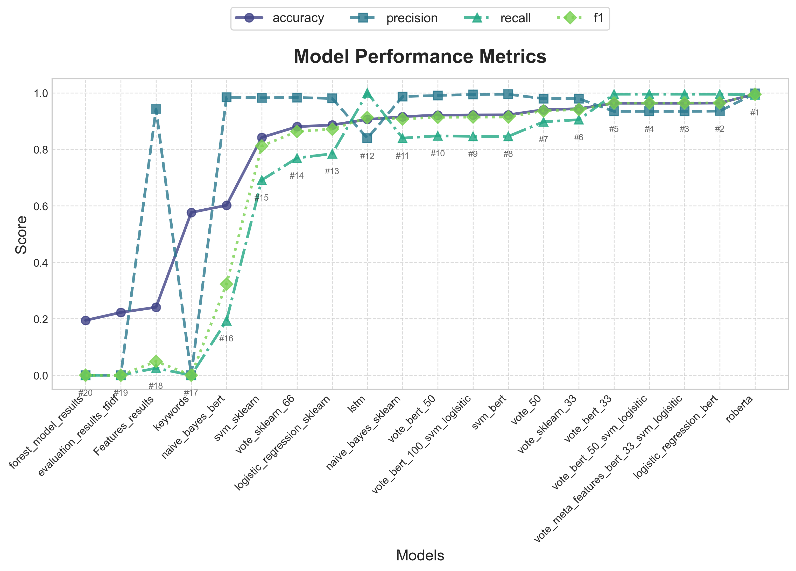
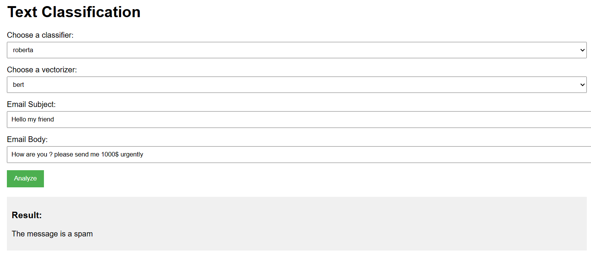

# 🛡️ Équipe Défense : Détection de Spams  

## 📖 **Objectif**  
Ce repository contient les travaux de l’équipe Défense pour :  
- Développer un modèle de classification capable de **détecter les spams**.  
- Évaluer et comparer notre solution avec les outils existants.  

## La comparison des modéles developés



## **Installation**

Cloner le dépôt `git`:

```bash
git clone https://github.com/pic-spam-detection/defensive.git
cd defensive
```

Installer les librairies nécessaires :

```bash
pip install -r requirements.txt
```

## **Usage**

### Testing
#### Terminal use
Warning : Commande non à jour. Risque de ne pas fonctionner sur certains modèles. Veuillez tester avec l'application web ci-dessous, ou avec l'évaluation (partie suivante).
```bash
python3 spam_detection.py --model [model] --subject [subject] --body ["this is a spam mail"]
python3 spam_detection.py --help
```

#### Application web



Lancez :
```bash 
python3 spam_detection.py
```

Puis dans votre navigateur accédez à http://127.0.0.1:5000/ .

Warning : les modèles utilisant BERT (hors RoBERTa), ainsi que le vote ne sont pas encore supportés sur l'application web.
Le premier lancement de chaque modèle peut prendre du temps.


return : array(is_spam), array(is_spam==ground_truth)

### Evaluation (accuracy, precision, recall, f1)
Le set de données utilisées est (`data/enron_spam_data.csv`)

```bash
python3 evaluate.py test --classifier [classifier] --vectorizer [sklearn, bert] --save-results [classifier.json]

or

python3 evaluate.py test --classifier [classifier] --vectorizer [sklearn, bert] --save-results [classifier.json] -train-embeddings-path embeddings/train.pt --test-embeddings-path embeddings/test.pt
```

With a HuggingFace model (mshenoda/roberta-spam) :
```bash
python evaluate.py test --classifier roberta --save-results [roberta.json] --save-checkpoint false
```

### Evaluation of a custom dataset (accuracy, precision, recall, f1)
L'ensemble de données doit suivre le meme format que (`data/enron_spam_data.csv`)

```bash
python3 evaluate.py evaluate-dataset --file-path [path_to_dataset.csv] --save-results [results.csv]
```

## **Code usage**

Pour charger le dataset : \
_Pour simplement charger la version raw du dataset, cf utils/dataset.py_


```python
from utils.dataset import get_dataset

data = get_dataset()
```

data : dictionnaire {"train": pandas dataframe, "test": pandas dataframe}

Format de train et set :

| Message ID | subject | body | address | domain | domain_extension | ground_truth |
|------------|---------|------|---------|--------|------------------|--------------|
| 8280       | this is a ham | contenu du mail | test_user | gmail | com | 0 |
| 14425      | this is a spam | contenu du mail | test_user.spammer | gmail | com | 1 |


À la première utilisation, le modèle se chargera, ce qui prend quelques minutes.

## **Remarque**

Selon votre environnement, pour avoir les imports, il peut être nécessaire de lancer avec l'option -m :
EXEMPLE : python3 -m defensive.models.neural_network
